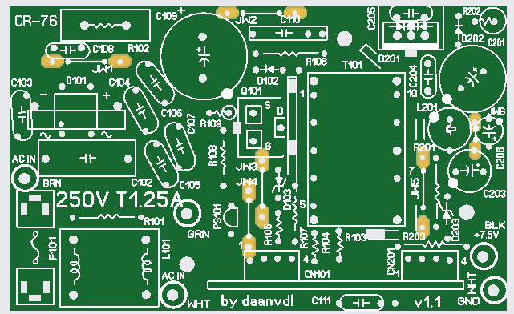

# Macintosh Portable M5136Z (CR-76E) Adapter PCB

## Overview
This project provides a **drop-in replacement PCB** for the **Sony Macintosh Portable M5136Z (CR-76E)** power board (Sony design).
It is intended as a 1-to-1 replacement for the original PCB, allowing reliable restoration of Macintosh Portable systems where the original power board has become unreliable or irreparably damaged.

---

## Reason for This Project
Due to the use of **poor-quality electrolytic capacitors**, many original Macintosh Portable power PCBs have suffered from:
- severe electrolyte leakage,
- electrical instability,
- or structural damage to the point where repair is no longer safe or reliable.

In many cases, recapping alone is not sufficient, and replacing the PCB is the only sensible long-term solution.
This adapter PCB was designed to address exactly that problem.

---

## Board
- ✅ Fully drop-in replacement. No system modifications required
- ✅ 1-to-1 replica of the original Sony CR-76E PCB
- ✅ Identical connectors, layout, and functionality
- ✅ Jumper wires have been replaced by PCB traces on the top layer

Electrically and functionally, this board behaves the same as the original.

---

## Compatibility
- Macintosh Portable **M5136Z**
- Power board: **Sony CR-76E**

---

## PCB Specifications
- **PCB thickness:** 1.6 mm
- **Surface finish:** HASL (sufficient for this design)
- **Layers:** 2-layer PCB

---

## Bill of Materials (BOM)
The BOM will follow.

---

## Disclaimer
This project is intended for retro-computing and restoration purposes nly. Use at your own risk. Always verify output voltages before connecting valuable hardware.

---

*With this project, I hope to help preserve the Macintosh Portable by providing a reliable and reproducible replacement for one of its most failure-prone components.*
